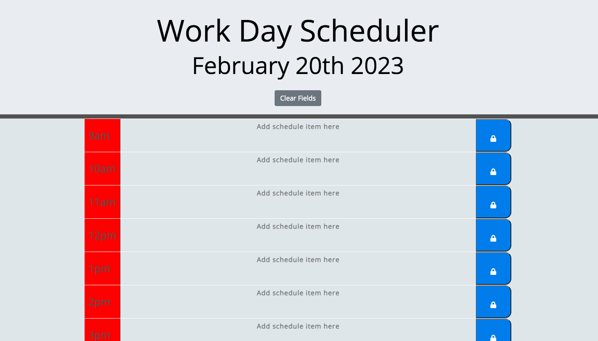

# daily-planner

## Description

This weeks challenge was to create a daily planner. The user story is AS AN employee with a busy schedule
I WANT to add important events to a daily planner SO THAT I can manage my time effectively. The acceptance criteria for the planner was to display the current day at the top of the calendar when a user opens the planner, present timeblocks for standard business hours when the user scrolls down, color-code each timeblock based on past, present, and future when the timeblock is viewed, allow a user to enter an event when they click a timeblock, save the event in local storage when the save button is clicked in that timeblock and persist events between refreshes of a page.

## Usage

The page displays the 9-5 work hours, with hourly slots where a user can input their events. The page allows the user to type in the important events in the slots, and to save the event, the user can click on the lock buton next to the text. This will save the events for each slot to local storage. The clear button clears all inputs the user has put in. Below is an image showing the page:

Here is a link to the GitHub repo: https://github.com/shazzy-kawa/daily-planner.git
Here is a link to the deployed page: https://shazzy-kawa.github.io/daily-planner/ 

## License

This was completed using an MIT license.
